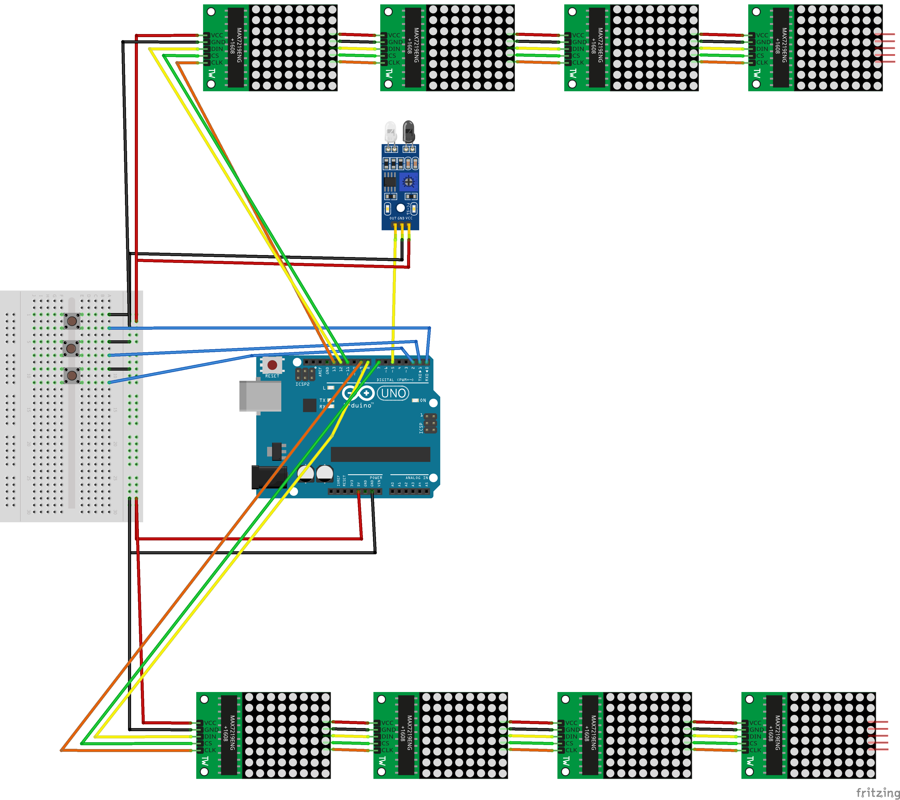

# Table Tennis Counter for Arduino

## Hardware Setup

For this setup we need
* Arduino Uno
* 3 Push Buttons
* 2 x 4 LED Matrices (8x8) using MAX7219 or MAX7221
* Optional: IR Receiver Module

## Software
